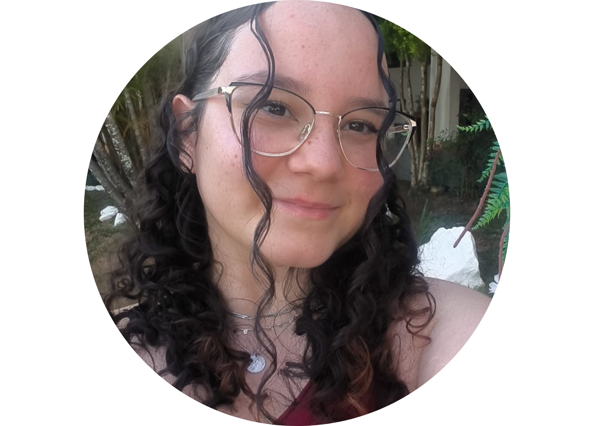

# 🌟 Portfólio de Sarah Batagioti! 🌟

  

Olá! Eu sou a Sarah — seja muito bem-vindo(a) ao meu portfólio 😊✨  
Aqui você encontrará um pouco da minha trajetória profissional, alguns dos projetos que desenvolvi e os principais canais para entrar em contato comigo.  

Para saber **mais sobre mim**, acesse os links abaixo:
- [🔗 Perfil no LinkedIn](https://www.linkedin.com/in/sarahbatagioti/)
- [📧 E-mail para contato](mailto:sarah.montuanibt@gmail.com)
- [💬 Whatsapp para contato](https://api.whatsapp.com/send?phone=5512981282279&text=Oi%20Sarah!%20Tudo%20bem?%20Gostaria%20de%20falar%20com%20voc%C3%AA%20sobre...)
- [🐙 Repositórios do GitHub](https://github.com/SarahBatagioti?tab=repositories)
- [📄 PDF do Currículo](arquivos/SarahMontuaniBatagioti.pdf)

## 📚 Resumo sobre mim

**Formação**
- Estudante de **Desenvolvimento de Software Multiplataforma** (4° semestre | Matutino) na FATEC São José dos Campos (2024 – 2026)
- Técnica em **Desenvolvimento de Sistemas** pela ETEC Professora Ilza Nascimento Pintus (2021 – 2023)

**Experiência anterior:**
- **Analista de Sistemas** na Angular Tecnologia em Educação LTDA (Outubro de 2024 – Outubro de 2025)
- **Analista de Testes** na Symtropy Criação e Desenvolvimento (Janeiro de 2024 – Setemebro de 2024)
- **Menor Aprendiz**, com foco em design, prototipação e desenvolvimento de interfaces (Junho de 2022 – Dezembro de 2023)

**Voluntariados:**
- Voluntária no time de Apoio na Hamburgada do Bem (2025) 
- Voluntária no time Lar Global iGV da AIESEC (2024 – 2025)
- Voluntária e fundadora do projeto de reabertura da biblioteca da ETEC (2022)
- Voluntária como Diretora de Imagem no Interact Club (2020 – 2021)

**Conquistas:**
- Premiada no programa Desafio Empower (2023)
- Eleita aluna destaque na Technovation Summer School for Girls (2023) 
- Equipe premiada na Off-Season FRC com o Quality Award - Team 6404 (2021)
- 2° lugar no Ideathon "Construindo o Profissional do Futuro" da INOVA CPS (2021)
- Medalhista de Ouro na Olimpíada Brasileira de Astronomia (2020)
- Medalhista de Ouro na Mostra Brasileira de Foguetes (2020)
- Medalhista de Bronze na Mostra Brasileira de Foguetes (2019)

## 🔗 Saiba mais sobre meus projetos

- [Aprendizagem por Projetos Integrados](aprendizagem-por-projetos-integrados.md)
- [Projetos acadêmicos](projetos-academicos.md)
- [Projetos profissionais](projetos-profissionais.md)
- [Projetos pessoais](projetos-pessoais.md)

