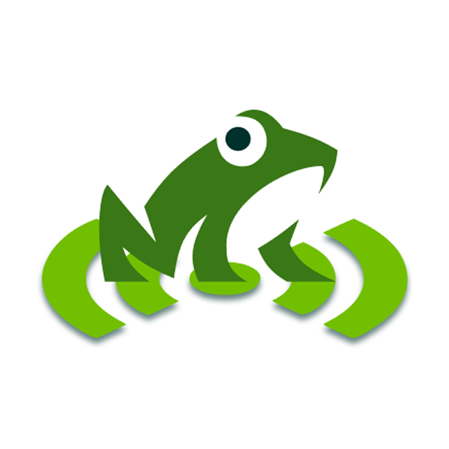
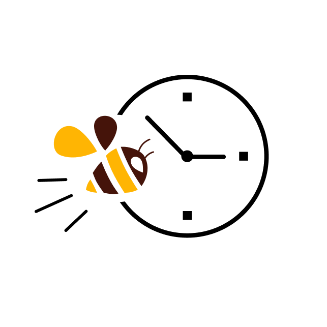
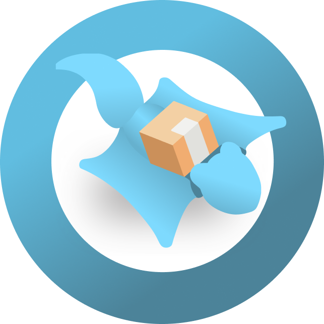

# 💡 Aprendizagem por Projetos Integrados - Meus Projetos

### 🐸 [**Atmos • 2025.2**](https://github.com/SkyFlyTeam/Atmos-documentation)

#### 📑 **Descrição do Problema**

Com o acontecimento de eventos climáticos extremos — como **deslizamentos de terra, enchentes e alagamentos** — comunidades mais vulneráveis sofrem impactos ainda maiores, especialmente em regiões periféricas, que muitas vezes **não contam com sistemas de alerta antecipado**.  
A ausência de monitoramento adequado torna essas populações mais expostas, dificultando a prevenção de acidentes e a atuação de equipes responsáveis.

#### 🎯 **Solução**

O **Atmos** foi desenvolvido em parceria com a empresa **Tecsus** para oferecer uma solução moderna e eficiente de **monitoramento climático e análise de condições do solo**.  
A aplicação reúne dados de **estações meteorológicas distribuídas pela cidade**, processa informações em tempo real e **emite alertas automáticos** quando são detectados riscos em potencial.  

O sistema conta com recursos como:
- Visualização de informações ambientais em dashboards interativos  
- Monitoramento contínuo das estações  
- Emissão de alertas customizados  
- Gestão de usuários e perfis  
- Histórico de dados coletados  

Esse conjunto de funcionalidades contribui para **mitigar riscos**, **salvar vidas**, e **fornecer suporte às equipes de resposta e prevenção**.

#### 🖥️ **Tecnologias Utilizadas**

#### 💪 **Contribuições Pessoais**

Nesse semestre atuei como **Scrum Master** da equipe SkyFly, exercendo um papel fundamental na organização do fluxo de trabalho e na saúde do time. Entre as principais contribuições, destaco:

- **Condução das Daily Scrums** com foco no alinhamento das entregas e remoção de impedimentos.  
- **Acompanhamento constante das atividades**, garantindo fluidez no progresso das sprints.  
- **Facilitação das cerimônias Scrum**, incluindo:  
  - Sprint Planning  
  - Sprint Review  
  - Retrospective  
  - Daily Scrum  
- **Colaboração ativa com o Product Owner**, contribuindo para refinar backlog, analisar prioridades e remover bloqueios.  
- **Apoio na organização e disciplina do time**, garantindo que a metodologia fosse aplicada corretamente.  

Além das responsabilidades de Scrum Master, atuei também como **desenvolvedora full-stack**, sendo responsável por:

- Tela de **edição de perfil**  
- **Gráficos do dashboard**, utilizando a biblioteca *Recharts*  
- **Cards de informações ambientais**  
- **Modal de notificações** com filtros avançados  

#### 🛠️ **Hard Skills Efetivamente Desenvolvidas**

- **Prototipação no Figma**: Criação de interfaces claras e funcionais, estruturando fluxos e componentes essenciais do sistema.  
- **Git e GitHub**: Versionamento consistente, criação de branches, workflows e revisão de PRs.  
- **Gerenciamento de Tarefas no Jira**: Organização de sprints, controle de impedimentos e acompanhamento do progresso.  
- **Uso da biblioteca Recharts (React)**: Desenvolvimento de gráficos interativos e dashboards dinâmicos.  

#### 🧠 **Soft Skills Efetivamente Desenvolvidas**

- **Foco no Resultado**: Priorização contínua das entregas e da estabilidade do produto durante as sprints.  
- **Comunicação Responsável**: Necessária especialmente em momentos delicados, como a **realização de desligamento de um membro da equipe**, exigindo clareza, empatia e firmeza.  
- **Resolução de Conflitos**: Mediação de atritos internos e reconciliação de expectativas entre PO, devs e stakeholders.  
- **Organização e Gestão de Tempo**: Priorização de tarefas e acompanhamento disciplinado dos prazos da sprint.  
- **Liderança Servidora**: Apoiar o time, remover barreiras e promover autonomia.  
- **Facilitação**: Condução de reuniões produtivas, direcionando discussões e garantindo foco no objetivo.  
- **Adaptabilidade**: Capacidade de ajustar processos e dinâmicas internas de acordo com as necessidades do time.  
- **Escuta Ativa**: Compreensão das dificuldades individuais dos membros e suporte para melhorar o desempenho coletivo.  

---

### 🐝 [**BeeOnTime • 2025.1**](https://github.com/SkyFlyTeam/beeOnTime-documentation)

#### 📑 **Descrição do Problema**

Empresas enfrentam diversos desafios no controle de ponto eletrônico de colaboradores, como:

- Falta de controle eficiente de frequência.
- Dificuldades no processamento de férias e afastamentos.
- Inconsistências no cálculo de horas extras.
- Análises imprecisas sobre atrasos e falta de pontualidade.
- Desorganização nas folhas de ponto.
- Ausência de acesso fácil a relatórios e análises detalhadas.

#### 🎯 **Solução**

O **BeeOnTime** é uma aplicação web moderna e responsiva que **simplifica o gerenciamento de ponto**, oferecendo funcionalidades completas para o registro e controle das horas trabalhadas, horas extras, férias, folgas, justificativas e ajustes de jornada. Além disso, a plataforma inclui marcação de ponto, espelho de ponto, banco de horas, relatórios detalhados e envio de notificações. 

A solução melhora a **pontualidade, facilita o acompanhamento das horas trabalhadas e promove maior organização e precisão na gestão de ponto eletrônico.**

#### 🖥️ **Tecnologias Utilizadas**

#### 💪 **Contribuições Pessoais**

Esse semestre atuei como Product Owner na equipe SkyFly, tendo as seguintes contribuições:

- **Reuniões de Kickoff e acompanhamento junto ao cliente**: Alinhamento de requisitos e expectativas com o cliente, garantindo uma comunicação clara durante todo o processo de desenvolvimento.
- **Definição da Lista de Tarefas**: Responsável pelo gerenciamento do backlog do produto, definição de tarefas no JIRA, estimativas e delegação estratégica de atividades.
- **Gestão de Tarefas**: Criação de tarefas com critérios de aceitação, gestão de dependências entre tarefas e acompanhamento do progresso semanal.
- **Metodologias de Entrega**: Implementação de entregas específicas durante a sprint para garantir entregas contínuas e não apenas no final.
- **Acompanhamento de Tarefas**: Levantamento semanal de tarefas pendentes, em andamento e concluídas, além de lembretes de prazos.
- **Participação em Dailys**: Contribuição com visão geral do projeto, abordando o andamento e alinhamento do desenvolvimento.
- **Revisão de PRs**: Análise de PRs, testes unitários e integrados, e verificação do cumprimento dos requisitos.
- **Documentação do Projeto**: Desenvolvimento da documentação de cada sprint, apresentações e manuais de usuário, além de definir regras de commit, PR e critérios de aceitação.

#### 🛠️ **Hard Skills Efetivamente Desenvolvidas**
- **Desenvolvimento de protótipos no Figma**: Criação e prototipagem de interfaces de usuário no Figma, com mais de 50 telas criadas, variando entre elas e detalhando componentes, além de todas as telas adaptadas a visualização mobile.
- **Desenvolvimento de documentação**: Elaboração de documentação técnica, incluindo Product Backlog, DoR (Definition of Ready), DoD (Definition of Done), regras de permanência mínima na equipe, manual do usuário, e documentação de processos e regras do projeto.
- **Testes unitários e integrados**: Implementação de testes para garantir a qualidade e integridade do código, tanto em unidades isoladas quanto em integração com outras partes do sistema.
- **Utilização do MySQL e MongoDB**: Gerenciamento e manipulação de bancos de dados relacionais (MySQL) e não relacionais (MongoDB) para armazenamento e gerenciamento de dados.
- **Git e GitHub**: Controle de versão de código-fonte usando Git, além de colaboração em projetos através do GitHub.
- **Gerenciamento de tarefas no Jira**: Planejamento, organização e acompanhamento do progresso das tarefas e sprints de desenvolvimento usando Jira.

#### 🧠 **Soft Skills Efetivamente Desenvolvidas**
- **Comunicação:** Como Product Owner, a comunicação foi essencial. Aprendi a importância de ouvir e explicar claramente cada tarefa para os membros da equipe, abordando não apenas o que deve ser feito, mas também o como, o que será testado, os cuidados necessários e a quem consultar. Durante as dailys e levantamentos mensais, pratiquei uma comunicação assertiva para destacar as necessidades da equipe e garantir entregas de qualidade. Também foi fundamental para alinhar as expectativas do cliente, esclarecer dúvidas e garantir que os requisitos fossem validados de acordo com o seu negócio, ajustando as entregas conforme a necessidade a cada sprint.

- **Resolução de problemas:** Em um ambiente escolar, tivemos espaço para errar e aprender com isso. Durante o projeto, enfrentamos desafios com prazos de entrega e qualidade, o que exigiu habilidades de resolução de problemas. Foi necessário reorganizar as tarefas para garantir que os itens da sprint fossem entregues conforme prometido, além de negociar o que era realmente importante para o produto final. A cada sprint, implementamos mudanças, como definir entregas contínuas ao invés de tudo no final, centralizar as análises de PR com o PO e o Scrum Master, realizar reuniões de validação com os desenvolvedores para facilitar a execução das tarefas, e realizar merges assim que as tarefas eram aprovadas. Além disso, promovemos acordos constantes sobre a comunicação dentro da equipe para melhorar a colaboração.

- **Organização e Gestão de Tempo**: Um bom Product Owner é aquele que otimiza o valor do produto, e o primeiro passo para um bom desenvolvimento é a organização das demandas e a gestão das atividades. Com base na compreensão das necessidades do cliente, conseguimos organizar o tempo e o volume de tarefas de forma eficaz. A gestão do tempo foi feita levando em consideração a dificuldade e facilidade do time na execução das tarefas. Também foi essencial alinhar as prioridades, garantindo que os requisitos principais e inegociáveis fossem sempre respeitados.

- **Liderança:** Como Product Owner, exerci a liderança da equipe SkyFly, gerenciando e orientando a execução das tarefas, garantindo que todos estivessem alinhados com os objetivos do produto e os requisitos do cliente. Isso envolveu a tomada de decisões estratégicas, a organização de trabalho de acordo com as forças de cada membro da equipe e a capacidade de influenciar positivamente o progresso do projeto.

---

### 🦔 [**CloudStock • 2024.2**](https://github.com/SkyFlyTeam/cloudStock)

#### 📑 **Descrição do Problema**

O **Cloud Stock** foi desenvolvido para resolver problemas comuns no gerenciamento de estoque, como a falta de organização, erros no controle de entradas e saídas de produtos, e dificuldades em gerar relatórios precisos. Isso pode levar a falhas nas decisões estratégicas, perda de inventário e aumento de erros humanos.

#### 🎯 **Solução**

O **Cloud Stock** oferece uma plataforma completa para a gestão de estoque, com funcionalidades como cadastro de itens, controle de movimentações, geração de relatórios detalhados e alertas automáticos. Isso permite uma gestão mais eficiente, minimiza os erros humanos e otimiza o acompanhamento do inventário.

#### 🖥️ **Tecnologias Utilizadas**

#### 💪 **Contribuições Pessoais**
Atuei como **desenvolvedora front-end**, contribuindo na prototipação do sistema utilizando o Figma, incluindo a criação da identidade visual e logotipo final. Durante o desenvolvimento, fui responsável pela construção de várias telas e componentes do sistema, aplicando **React** e **TypeScript** para criar uma interface responsiva e interativa. Além disso, participei da **gestão de tarefas** no **Jira**, colaborando ativamente no acompanhamento das sprints e no alinhamento do progresso do projeto.

#### 🛠️ **Hard Skills Efetivamente Desenvolvidas**
- **Modelagem de Banco de Dados**: Criação e estruturação de bancos de dados eficientes para garantir o armazenamento e a integridade das informações de estoque.
- **Prototipação pelo Figma**: Desenvolvimento de wireframes e protótipos interativos, com foco na usabilidade e no design visual do sistema, garantindo uma experiência de usuário fluida.
- **Front-End com React**: Construção de componentes reutilizáveis e interfaces responsivas, utilizando **React** para otimizar a interação do usuário com o sistema.
- **Documentação Técnica**: Elaboração de manuais do usuário, documentação de processos e do sistema, garantindo clareza nas informações e uma fácil integração para novos membros da equipe.do usuário

#### 🧠 **Soft Skills Efetivamente Desenvolvidas**
- **Comunicação**: Interação constante com membros da equipe e stakeholders para alinhar requisitos e expectativas do projeto.
- **Proatividade**: Busca constante por soluções para problemas técnicos e colaboração para melhorar a eficiência da equipe.
- **Autonomia**: Capacidade de tomar decisões e implementar soluções de forma independente, enquanto mantinha o alinhamento com as necessidades do projeto.
- **Colaboração**: Trabalho em equipe para garantir o cumprimento de prazos e a qualidade das entregas, além de contribuir com feedbacks construtivos durante o desenvolvimento.

---

### 🌱 [**Smart Farm • 2024.1**](https://github.com/SkyFlyTeam/SmartFarm)

#### 📑 **Descrição do Problema**

O **Smart Farm** é um sistema tecnológico de monitoramento ambiental, projetado para otimizar o cultivo de plantas e hortaliças. Atualmente, a coleta e análise dos dados são feitas manualmente através do Excel, um processo que é demorado e exigente para a equipe. Esse método dificulta o acompanhamento eficaz do crescimento das plantas e impacta a eficiência na gestão da estufa.

#### 🎯 **Solução**

Desenvolver um painel de visualização que permita o monitoramento contínuo da estufa, utilizando gráficos para apresentar os dados de forma clara e acessível. Além disso, automatizar o processo de coleta e armazenamento de dados, proporcionando uma solução mais ágil e precisa para o acompanhamento e gestão do cultivo.

#### 🖥️ **Tecnologias Utilizadas**

#### 💪 **Contribuições Pessoais**
Atuei como **desenvolvedora full-stack** no **Smart Farm**, sendo responsável pela **modelagem do banco de dados** e pela criação do **backlog do produto**. Também ajudei na prototipação do projeto com **Figma** e na **documentação do manual do usuário**. No desenvolvimento, colaborei na criação de componentes de interface e na implementação de funcionalidades com **Python** e **MySQL**. Trabalhei ativamente no **front-end**, cuidando do desenvolvimento em algumas telas.

#### 🛠️ **Hard Skills Efetivamente Desenvolvidas**
- **Modelagem de Banco de Dados**: Design e estruturação do banco de dados, utilizando **MySQL** para armazenar dados do sistema.
- **Desenvolvimento Full-Stack com Python e MySQL**: Criação de APIs e lógica de negócios, além de integrar o sistema com o banco de dados.
- **Prototipação com Figma**: Desenvolvimento de wireframes e design de interface de usuário.
- **Documentação Técnica**: Criação de manuais de usuário e documentação técnica do sistema.

#### 🧠 **Soft Skills Efetivamente Desenvolvidas**
- **Comunicação**: Discussão constante com a equipe para alinhar as expectativas do cliente e as necessidades técnicas do projeto.
- **Proatividade**: Tomada de iniciativa para buscar soluções rápidas e eficazes, além de aprender novas tecnologias conforme necessário.
- **Autonomia**: Desenvolvimento independente de funcionalidades e capacidade de resolução de problemas técnicos de forma autônoma.
- **Colaboração**: Contribuição ativa para o desenvolvimento das funcionalidades e entregas dentro do prazo, garantindo a integração entre as equipes de front-end e back-end.

[Voltar a página principal](README.md)
