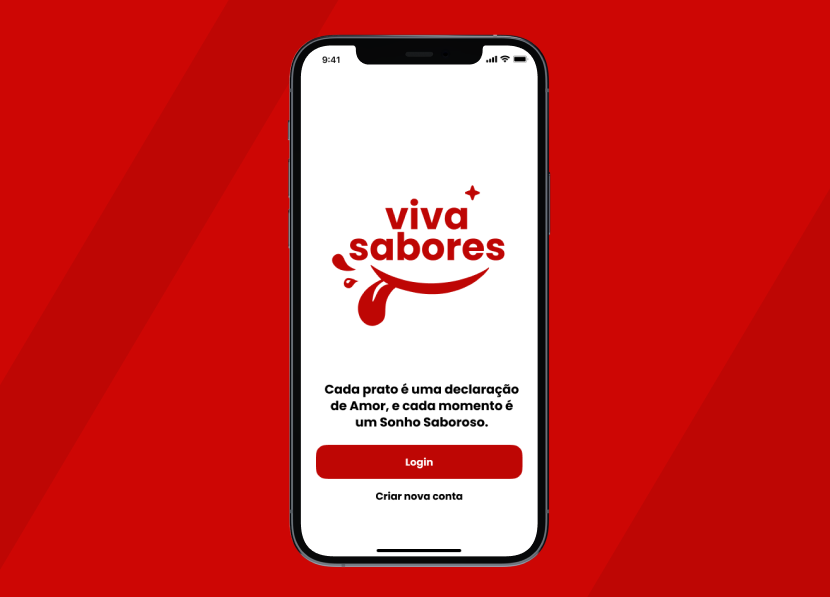
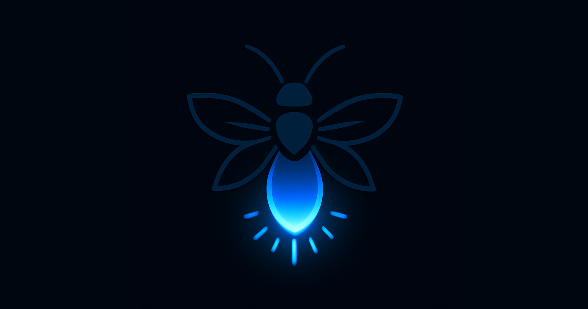
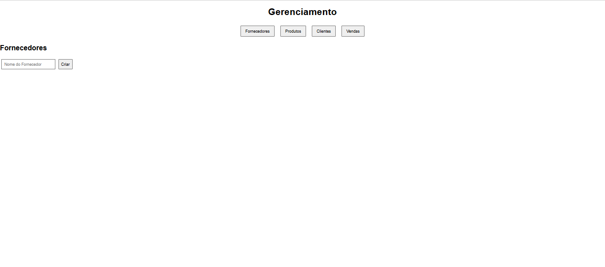
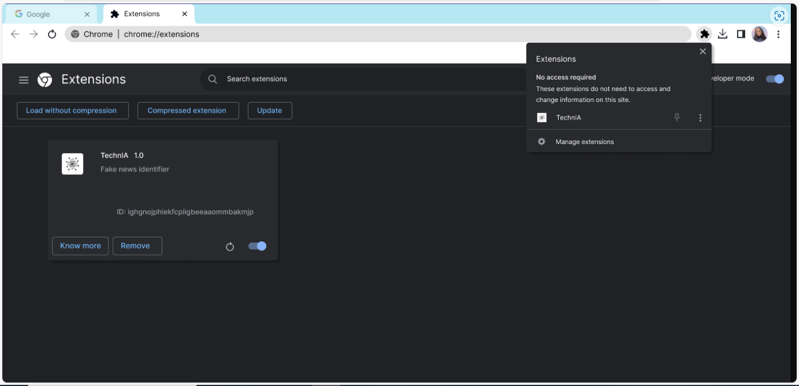

# 💡 Projetos Acadêmicos

### 🍽️ [**Viva Sabores • 2025**](https://github.com/SarahBatagioti/app-receitas)

#### 📑 **Descrição do Problema**

Aplicativo de receitas culinárias que permite aos usuários explorar, salvar e compartilhar suas receitas favoritas, além de criar listas de compras personalizadas.

#### 🖥️ **Tecnologias Utilizadas**

---

### 🔍 [**Vagalume - Raspagem de Dados • 2025**](https://github.com/SarahBatagioti/bertoti-vagalume)

#### 📑 **Descrição do Problema**

Raspagem de dados do Linkedin para coleta de dados profissionais e resumo utilizando LLM Ollama.

#### 🖥️ **Tecnologias Utilizadas**

---

### 🌍 [**MBViagens • 2024**](https://github.com/SarahBatagioti/Desafio3)

#### 📑 **Descrição do Problema**

Site desenvolvido para ter aprendizado sobre conexão com banco de dados, ao ter uma tela de registro de roteiros de viagem, e de utilização do Docker.

#### 🖥️ **Tecnologias Utilizadas**

---

### 🛒 [**Requisições ORM • 2024**](https://github.com/SarahBatagioti/requisicoesORM)

#### 📑 **Descrição do Problema**

Sistema usando requisições ORM, com disponibilidade de teste de rotas no back e front. Tem o objetivo de fazer um histórico de compras.

#### 🖥️ **Tecnologias Utilizadas**

---

### 🦯 [**IZZIE - Bengala Inteligente • 2023**](https://github.com/SarahBatagioti/TCC-IZZIE-ARDUINO)

#### 📑 **Descrição do Problema**

Ferramenta inovadora e eficaz que promove a mobilidade independente, segurança e autonomia de crianças portadoras de cegueira em diferentes ambientes internos, visando facilitar a exploração do espaço, garantir a detecção de obstáculos e oferecer auxílio auditivo.

#### 🖥️ **Tecnologias Utilizadas**

---

### 📰 [**IA Detectora de Fake News • 2023**](https://github.com/SarahBatagioti/IA-detectora-de-fake-news)

#### 📑 **Descrição do Problema**

Projeto desenvolvido na quinta edição do Technovation Summer School For Girls. O protótipo consiste em uma inteligência artificial treinada para detectar padrões comuns em informações falsas.

#### 🖥️ **Tecnologias Utilizadas**

[Voltar a página principal](README.md)
