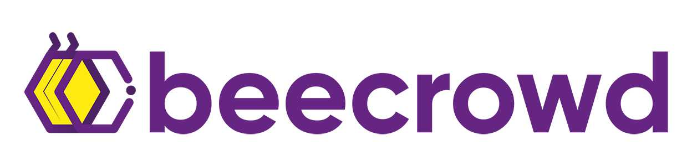

# 💡 Projetos Pessoais

### 🐍 [**Exercícios BeeCrowd em Python • 2025**](https://github.com/SarahBatagioti/beecrowd-python)

#### 📑 **Descrição do Problema**

Coleção de exercícios resolvidos na plataforma BeeCrowd (anteriormente conhecida como URI Online Judge), onde são trabalhados problemas de programação e algoritmos em Python. O objetivo é desenvolver habilidades de lógica de programação, estrutura de dados e algoritmos, além de praticar com desafios práticos.

#### 🖥️ **Tecnologias Utilizadas**

---

### 🖥️ [**Exercícios BeeCrowd em C# • 2025**](https://github.com/SarahBatagioti/beecrowd-csharp)

#### 📑 **Descrição do Problema**

Coleção de exercícios resolvidos na plataforma BeeCrowd utilizando a linguagem C#. O projeto tem como objetivo explorar a implementação de algoritmos e estruturas de dados em C#, além de melhorar as habilidades de resolução de problemas lógicos.

#### 🖥️ **Tecnologias Utilizadas**

---

### 👥 [**CRUD Usuários 2025 • 2025**](https://github.com/SarahBatagioti/CRUD-Usuarios)

#### 📑 **Descrição do Problema**

Sistema CRUD de usuários, com funcionalidades completas de **Criar, Ler, Atualizar e Deletar** usuários. Além disso, implementa **máscaras e validações** de dados como e-mail, telefone, CPF e data. Possui uma funcionalidade de **busca por CEP** com auto-preenchimento de endereço, e feedbacks de sucesso/erro para interações do usuário, incluindo o bloqueio de ações inválidas.

#### 🖥️ **Tecnologias Utilizadas**

[Voltar a página principal](README.md)
