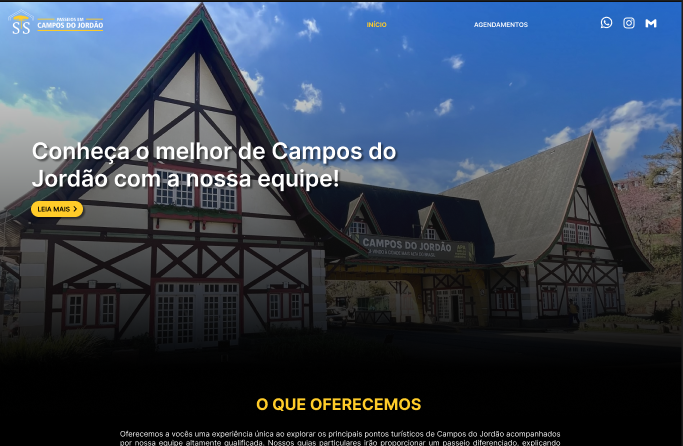
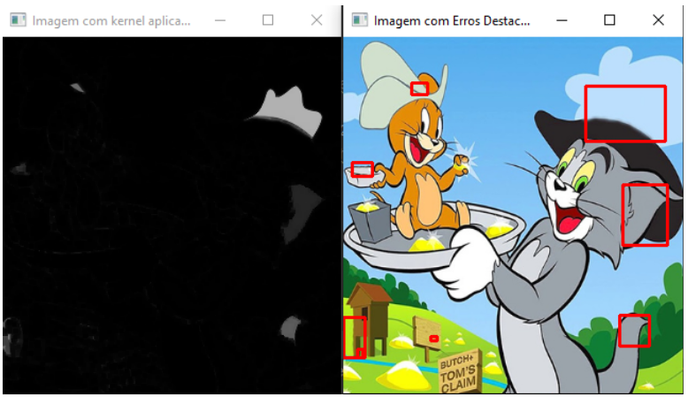

# 💡 Projetos Profissionais

### 🏞️ [**SS Passeios em Campos do Jordão • 2023**](https://github.com/SarahBatagioti/SS-PASSEIOS-EM-C.-DO-JORDAO)

#### 📑 **Descrição do Problema**

Desenvolvido como trabalho freelance, onde junto com meu colega de trabalho fizemos um site de apresentação da loja do cliente. Colaborei com a elaboração do design do site e a estilização.

#### 🖥️ **Tecnologias Utilizadas**

---

### 🎮 [**Jogo dos 7 Erros com OpenCV • 2022**](https://github.com/SarahBatagioti/Implementar-jogo-7-erros-em-Python)

#### 📑 **Descrição do Problema**

Com o objetivo de, no final, fazer um programa para identificar erros em peças de uma indústria, durante meus estudos consegui desenvolver um jogo de sete erros, que faz a subtração de duas imagens.

#### 🖥️ **Tecnologias Utilizadas**

[Voltar a página principal](README.md)
